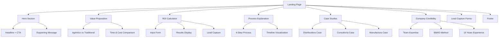
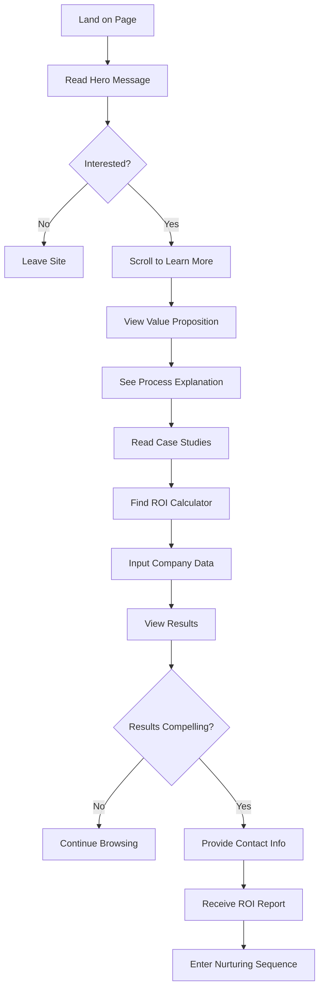

# HasugueSoft Landing Page UI/UX Specification

## Introduction

This document defines the user experience goals, information architecture, user flows, and visual design specifications for HasugueSoft Landing Page's user interface. It serves as the foundation for visual design and frontend development, ensuring a cohesive and user-centered experience that converts Colombian PyME decision-makers into qualified leads.

### Overall UX Goals & Principles

#### Target User Personas

**Primary Persona: PyME Decision Maker**
- **Profile:** Business owners/managers of 50-500 employee companies in Colombia
- **Industries:** Distribuidoras, servicios profesionales, manufactura ligera
- **Pain Points:** Manual processes consuming 15-25% of operational time, limited technical knowledge, budget constraints
- **Goals:** Reduce operational costs, improve efficiency, maintain competitive advantage
- **Technology Comfort:** Basic to intermediate, prefers simple explanations over technical jargon

**Secondary Persona: Operations Manager**
- **Profile:** Mid-level managers responsible for process optimization
- **Characteristics:** More technically savvy, influences purchasing decisions, seeks concrete ROI data
- **Goals:** Demonstrate value to leadership, implement solutions that reduce team workload
- **Decision Factors:** Proven results, implementation timeline, ongoing support

#### Usability Goals

1. **Immediate Value Communication:** Visitors understand the value proposition within 10 seconds of landing
2. **Educational Journey:** Non-technical users learn about "desarrollo agéntico" without feeling overwhelmed
3. **Trust Building:** Conservative PyME decision-makers feel confident choosing a newer company
4. **Lead Qualification:** ROI calculator captures qualified leads while providing genuine value
5. **Mobile Optimization:** 70% of traffic is mobile - all interactions must be thumb-friendly
6. **Conversion Efficiency:** 8-12% visitor-to-lead conversion rate through optimized funnel

#### Design Principles

1. **Credibilidad sobre Creatividad** - Professional, trustworthy design over flashy innovation
2. **Educación Progresiva** - Guide users from awareness to understanding to action
3. **Simplicidad Sofisticada** - Demonstrate technical capability through clean, efficient design
4. **Contexto Colombiano** - Use local terminology, currency, and cultural references
5. **Accesibilidad Universal** - Design for all users, including those with limited technical experience

### Change Log

| Date | Version | Description | Author |
|------|---------|-------------|---------|
| Dec 2024 | 1.0 | Initial UI/UX specification | Sally (UX Expert) |

## Information Architecture (IA)

### Site Map / Screen Inventory



### Navigation Structure

**Primary Navigation:** Single-page scroll navigation with sticky header containing:
- Logo (HasugueSoft)
- Navigation anchors: Inicio, Proceso, Casos, Calculadora, Contacto
- Primary CTA: "Solicitar Demo Gratuita"

**Secondary Navigation:** Smooth scroll between sections with progress indicator

**Breadcrumb Strategy:** Not applicable for single-page design, but section highlighting in navigation shows current position

## User Flows

### Flow 1: Lead Generation via ROI Calculator

**User Goal:** Understand potential savings from automation and provide contact information for follow-up

**Entry Points:** 
- Direct traffic from Google Ads
- Organic search for "automatización procesos PyMEs"
- Referral from business networks

**Success Criteria:** User completes ROI calculation and provides valid contact information

#### Flow Diagram



#### Edge Cases & Error Handling:
- Invalid calculator inputs: Show helpful validation messages with examples
- Email delivery failure: Provide alternative contact method and retry option
- Mobile form completion: Optimize for thumb typing and auto-complete
- Slow loading: Progressive loading with skeleton screens
- No JavaScript: Provide fallback contact form

**Notes:** Calculator is the primary conversion tool - must work flawlessly on all devices

### Flow 2: Educational Journey for Skeptical Visitors

**User Goal:** Learn about "desarrollo agéntico" and build confidence in the approach

**Entry Points:**
- Organic search for automation solutions
- Word-of-mouth referrals
- Industry publication mentions

**Success Criteria:** User understands the concept and requests more information

#### Flow Diagram

```mermaid
graph TD
    A[Skeptical Visitor] --> B[Read Headline]
    B --> C{Understand "Agéntico"?}
    C -->|No| D[Scroll to Value Prop]
    C -->|Yes| E[Continue to Process]
    D --> F[Compare Traditional vs Agéntico]
    F --> G[See Time/Cost Benefits]
    G --> H[View Process Steps]
    H --> I[Read Case Studies]
    I --> J{Convinced?}
    J -->|No| K[Check Company Credibility]
    J -->|Yes| L[Try ROI Calculator]
    K --> M[See 15 Years Experience]
    M --> N[Review BMAD Method]
    N --> O{Trust Established?}
    O -->|Yes| L
    O -->|No| P[Leave with Retargeting]
```

#### Edge Cases & Error Handling:
- Technical jargon confusion: Provide hover definitions and simple explanations
- Credibility concerns: Multiple trust signals throughout journey
- Information overload: Progressive disclosure with "Learn More" options

**Notes:** Education is critical for new category creation - content must be digestible

## Wireframes & Mockups

**Primary Design Files:** To be created in Figma after specification approval

### Key Screen Layouts

#### Hero Section
**Purpose:** Immediate value communication and primary conversion

**Key Elements:**
- Headline: "Automatiza tus procesos con IA en 6 semanas, no 6 meses"
- Subheadline: "15 años de experiencia enterprise + metodología agéntica = Resultados en tiempo récord"
- Primary CTA: "Solicitar Demo Gratuita" (prominent button)
- Supporting visual: Clean, modern illustration suggesting automation
- Trust indicator: "Empresas colombianas ya están ahorrando $85K anuales"

**Interaction Notes:** CTA button should have hover states and micro-animation. Background video or subtle animation to suggest innovation.

#### ROI Calculator Section
**Purpose:** Interactive lead generation tool providing genuine value

**Key Elements:**
- Calculator form with 4-5 input fields
- Real-time results display with visual charts
- Lead capture form integrated with results
- Social proof: "Empresas similares ahorran en promedio..."

**Interaction Notes:** Progressive form revelation, immediate calculation feedback, mobile-optimized input fields

#### Case Studies Showcase
**Purpose:** Build credibility through local success stories

**Key Elements:**
- Three industry-specific case studies
- Before/after metrics prominently displayed
- Client testimonial quotes (anonymized)
- Industry icons for quick identification

**Interaction Notes:** Tabbed or carousel interface for easy navigation between cases

## Component Library / Design System

**Design System Approach:** Custom design system optimized for Colombian PyME market, incorporating trust-building elements and professional aesthetics

### Core Components

#### Primary Button
**Purpose:** Main call-to-action elements throughout the page

**Variants:** 
- Primary (orange/blue gradient)
- Secondary (outline style)
- Ghost (text only)

**States:** Default, hover, active, disabled, loading

**Usage Guidelines:** Maximum 2 primary buttons visible at once, always include clear action text

#### Calculator Input
**Purpose:** ROI calculator form fields with validation

**Variants:**
- Number input with Colombian peso formatting
- Dropdown with industry-specific options
- Range slider for employee count

**States:** Empty, filled, error, success, disabled

**Usage Guidelines:** Always include helpful placeholder text and validation messages

#### Case Study Card
**Purpose:** Display success stories with metrics

**Variants:**
- Distribuidora theme (blue accent)
- Consultoría theme (green accent)  
- Manufactura theme (orange accent)

**States:** Default, hover (slight elevation)

**Usage Guidelines:** Consistent metric formatting, anonymized but credible details

## Branding & Style Guide

### Visual Identity
**Brand Guidelines:** Professional, innovative, trustworthy - balancing technical sophistication with approachability for traditional business owners

### Color Palette

| Color Type | Hex Code | Usage |
|------------|----------|-------|
| Primary | #2563EB | Primary CTAs, links, key highlights |
| Secondary | #7C3AED | Accent elements, secondary actions |
| Accent | #F59E0B | Success states, ROI highlights |
| Success | #10B981 | Positive metrics, confirmations |
| Warning | #F59E0B | Important notices, attention |
| Error | #EF4444 | Errors, validation messages |
| Neutral | #64748B, #F8FAFC | Text, borders, backgrounds |

### Typography

#### Font Families
- **Primary:** Inter (clean, professional, excellent readability)
- **Secondary:** Poppins (headings, more personality)
- **Monospace:** JetBrains Mono (code examples, technical specs)

#### Type Scale

| Element | Size | Weight | Line Height |
|---------|------|--------|-------------|
| H1 | 3.5rem | 700 | 1.1 |
| H2 | 2.5rem | 600 | 1.2 |
| H3 | 1.875rem | 600 | 1.3 |
| Body | 1rem | 400 | 1.6 |
| Small | 0.875rem | 400 | 1.5 |

### Iconography
**Icon Library:** Heroicons (consistent with modern web standards)

**Usage Guidelines:** Outline style for most elements, filled style for active states, 24px standard size

### Spacing & Layout
**Grid System:** 12-column CSS Grid with 1.5rem gutters

**Spacing Scale:** 0.25rem, 0.5rem, 1rem, 1.5rem, 2rem, 3rem, 4rem, 6rem (Tailwind-based)

## Accessibility Requirements

### Compliance Target
**Standard:** WCAG 2.1 AA compliance for Colombian market accessibility

### Key Requirements

**Visual:**
- Color contrast ratios: 4.5:1 for normal text, 3:1 for large text
- Focus indicators: 2px solid outline with high contrast
- Text sizing: Minimum 16px base size, scalable to 200%

**Interaction:**
- Keyboard navigation: Full tab order, skip links, logical flow
- Screen reader support: Semantic HTML, ARIA labels, alt text
- Touch targets: Minimum 44px for mobile interactions

**Content:**
- Alternative text: Descriptive alt text for all images and icons
- Heading structure: Logical H1-H6 hierarchy
- Form labels: Clear labels and error messages for all inputs

### Testing Strategy
Manual testing with keyboard navigation, automated testing with axe-core, screen reader testing with NVDA/VoiceOver

## Responsiveness Strategy

### Breakpoints

| Breakpoint | Min Width | Max Width | Target Devices |
|------------|-----------|-----------|----------------|
| Mobile | 320px | 767px | iPhone, Android phones |
| Tablet | 768px | 1023px | iPad, Android tablets |
| Desktop | 1024px | 1439px | Laptops, small monitors |
| Wide | 1440px | - | Large monitors, 4K displays |

### Adaptation Patterns

**Layout Changes:** Single column on mobile, multi-column on desktop, calculator stacks vertically on mobile

**Navigation Changes:** Hamburger menu on mobile, horizontal navigation on desktop

**Content Priority:** Hero message shortened on mobile, case studies in carousel format

**Interaction Changes:** Touch-optimized buttons on mobile, hover states on desktop

## Animation & Micro-interactions

### Motion Principles
Subtle, purposeful animations that enhance usability without distraction. Focus on feedback, transitions, and progressive disclosure.

### Key Animations
- **Page Load:** Staggered fade-in of sections (300ms, ease-out)
- **CTA Hover:** Slight scale and color transition (200ms, ease-in-out)
- **Calculator Input:** Real-time number formatting and validation feedback (150ms, ease-out)
- **Results Reveal:** Slide-up animation with number counting effect (500ms, ease-out)
- **Scroll Progress:** Navigation highlighting and progress indicator (100ms, linear)

## Performance Considerations

### Performance Goals
- **Page Load:** <3 seconds on 3G connection
- **Interaction Response:** <100ms for all user interactions
- **Animation FPS:** Consistent 60fps for all animations

### Design Strategies
Optimize images for web, lazy load below-the-fold content, minimize animation complexity, use system fonts as fallbacks, implement critical CSS inlining

## Technical Stack

**Frontend Framework**: Astro con TypeScript
- **Componentes Interactivos**: React para calculadora ROI y formularios
- **Styling**: Tailwind CSS con sistema de diseño personalizado
- **Animaciones**: Framer Motion para micro-interacciones
- **Performance**: SSG (Static Site Generation) de Astro para carga ultra-rápida
- **SEO**: Meta tags optimizados y structured data aprovechando Astro

## Next Steps

### Immediate Actions
1. Review specification with stakeholders and gather feedback
2. Create detailed visual designs in Figma based on this specification
3. Develop component library and design tokens
4. Prepare assets and copy for development handoff
5. Set up analytics and conversion tracking requirements

### Design Handoff Checklist
- [x] All user flows documented
- [x] Component inventory complete  
- [x] Accessibility requirements defined
- [x] Responsive strategy clear
- [x] Brand guidelines incorporated
- [x] Performance goals established
- [ ] Visual designs created in Figma
- [ ] Component library developed
- [ ] Copy and content finalized
- [ ] Analytics tracking defined